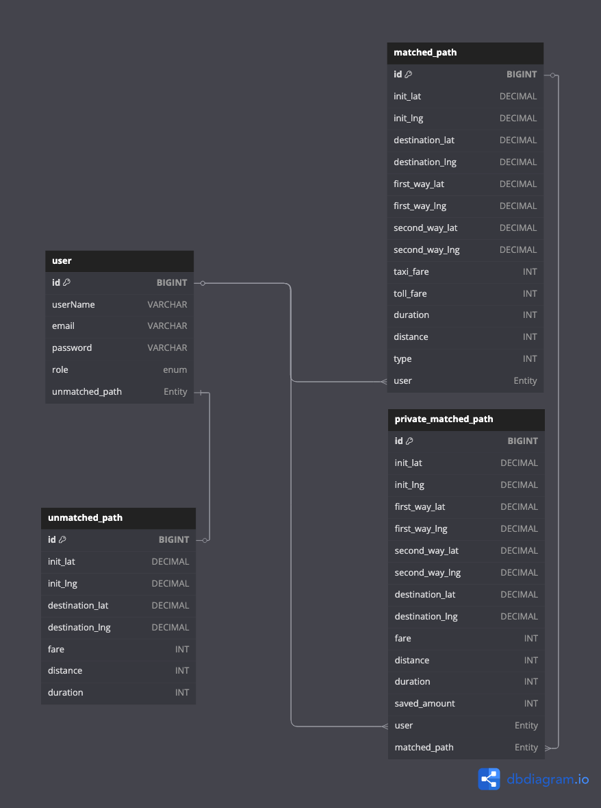

# 🚕 택시합승시스템 - 더 스마트하게, 더 저렴하게 이동하는 방법
기존에 진행했던 택시합승시스템을 기반으로, 문제를 개선하기 위해 리팩토링한 프로젝트입니다.

**출발지와 목적지만 입력하면, 최적의 동승자를 자동으로 매칭!**  
택시비는 나누고, 이동은 편리하게. 지금 바로 탑승해보세요.

---

## 👥 Contributors

<table>
  <tr>
    <td align="center"><a href="https://github.com/baecheolhyeon"> 배철현</a></td>
    <td align="center"><a href="https://github.com/HyunhoYu"> 유현호</a></td>
  </tr>
</table>

---

## 🚀 서비스 소개

### 📌 개요

**택시합승시스템**은 사용자의 출발지와 목적지를 기반으로 현재 탑승을 원하는 사용자들과 **최적의 경로로 자동 매칭**하여, 택시비를 나눌 수 있는 동승자를 연결해주는 플랫폼입니다.

> 불필요한 요금은 줄이고, 이동 중 대화는 늘리고  
> 도시 교통을 더 스마트하게 만들어보세요!

---

### 📑 문제 정의 및 해결책

- **문제점**
  - 택시비는 비싸고, 혼자 타긴 부담스러움
  - 심야시간 할증과 부족한 택시
  - 동승자를 직접 찾기엔 어려움 

- **해결책**
  - 경로 기반 알고리즘으로 실시간 매칭
  - 절약되는 금액 표시
  - 탑승 확정 후 위치 공유 기능으로 신뢰성 향상

---

## 🧑‍💻 주요 기능

| 기능                  | 설명                                                                   |
|---------------------|------------------------------------------------------------------------|
| 출발지/도착지 입력       | 사용자가 이동하고자 하는 경로를 입력합니다                                      |
| 최적 동승자 매칭         | 실시간으로 입력된 사용자 중 가장 경로가 유사한 사람과 매칭됩니다                      |
| 결제 기능               | 매칭 후 카카오페이 결제로 금액을 지불합니다                         |
| 택시 기사 매칭           | 근처 택시기사가 수락하면 택시가 매칭됩니다                              |
| 매칭 상태 확인            | 탑승을 대기하면서 택시의 위치를 확인할 수 있습니다                            |

---

## ⚙️ Backend Tech Stack

---

## 🧱 ERD 설계도

---
